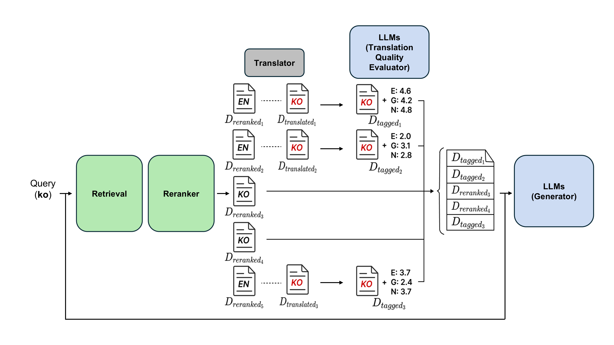

## This Repository is built upon BERGEN: A Benchmarking Library for Retrieval-Augmented Generation

Original Repo: https://github.com/naver/bergen 

QTT-RAG Paper: https://arxiv.org/abs/2510.23070
## Key Features

- Baseline
- CROSSRAG
- DKM-RAG
- HARD-FILTER
- **QTT-RAG** (Our proposed method)

<p align="center">
  
  <br>
  <em>Figure 1. Quality-Aware Translation Tagging (QTT) Pipeline Overview.</em>
</p>


For more information and experimental findings, please see baseline papers:
- CROSSRAG paper: https://arxiv.org/abs/2504.03616 
- DKM-RAG paper: https://arxiv.org/abs/2502.11175 

## Quick Start

You can configure each component using simple YAML files. Here's an example of running an experiment:
- This is example script for HARD-FILTER, QTT-RAG.
```bash
RUN_NAME="Your RUN_NAME"
EXP_FOLDER="Your EXP_FOLDER"
LOG_FOLDER="Your LOG_FOLDER"

python bergen_our_rag_tag.py \
  run_name="$RUN_NAME" \
  generator='exaone-3.5-7.8b' \
  translation_model='llama-31-8b-instruct' \ ### DKM-RAG needs refine_model instead of translation_model, No need to specify neither of them for CROSSRAG and Baseline  ###
  retriever='bge-m3' \
  reranker='bge-m3' \
  dataset='xor_tydiqa/xor_tydiqa_ar.retrieve_en_ar.yaml' \
  prompt='basic_translated_langspec/ar_score' ++experiments_folder="$EXP_FOLDER" ++run_name="$RUN_NAME" ++log_folder="$LOG_FOLDER" 
```
Change bergen files, configs and corresponding languages as you needed.

## Installation

Check : https://github.com/naver/bergen/blob/main/documentation/INSTALL.md 

